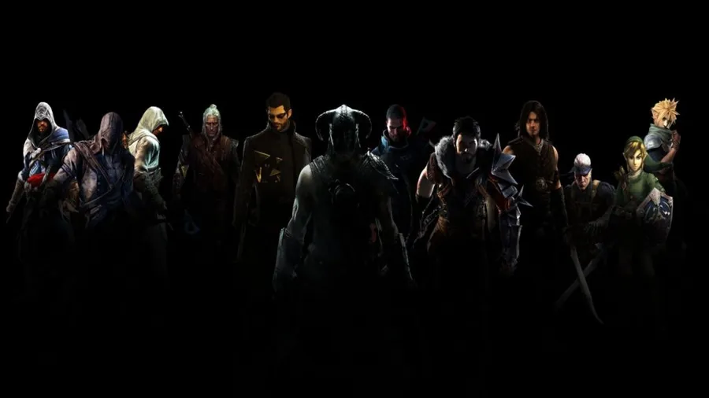

# ¡Hola, soy [FEDERICO]! 👋

🧑‍💻 **Desarrollador Web** | 🍞 **Panadero Artesanal** | 🚀 **Aprendiendo siempre**

---
## 🚀 Sobre mí
- 🌍 Vivo en Mendoza, Argentina.
- 🎨 Me apasiona el diseño web y la panadería artesanal.
- 🌱 Actualmente, estoy aprendiendo Angular y optimizando diseños para accesibilidad.

## 🛠️ Tecnologías que uso
- **Frontend**: Angular, HTML, CSS, JavaScript.
- **Backend**: Node.js, ExpressJS.
- **Bases de datos**: MySQL.

## 📈 Mi estadística de GitHub

## 📫 ¡Contáctame!
- [LinkedIn](https://www.linkedin.com/in/federico-barzola-7138b3216)
- [Portafolio](https://pincha1212.github.io/fb-frontend-with-angular/)
- 📧 Email: fedebarzola7@gmail.com
